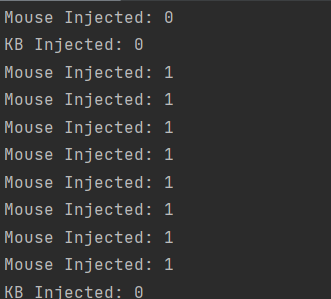

# Fake Keyboard/Mouse Checker

Simple keyboard and mouse hook that detects synthetic input.

Examples of synthetic input include: macros, autoclickers, any call to SendInput()

Examples of non-synthetic input: input directly sent by the driver (eg. Razer Synapse macros), real user input

## Usage
1. Run the program with arguments `-check` (preferably without any other programs that interfere with mouse/keyboard hooks)
2. The program will print `KB Injected: 0/1` and `Mouse Injected 0/1` whenever you press a key or click with the left/right mouse buttons.
3. If `KB Injected` or `Mouse Injected` is 1, then that means synthetic input was detected.

## Non-Synthetic Input API

There's a **work-in-process** feature (`-api` argument) that allows you to send mouse/keyboard input directly to the driver. This allows you to simulate non-synthetic input without conflicting with any other low-level hooks.

The program can currently interface with HID-compliant devices (which should be almost all mice/keyboards). However, I'm probably going to take a break from this project, so this feature will be unfinished for the forseeable future.

Things I still need to do for this feature:
- Setup a localhost web server so other languages can interface with my app
- Determine the bytes to send to the driver to trigger a click/keypress (requires reverse engineering the driver)
